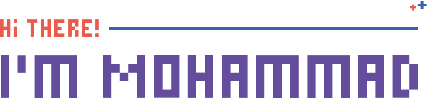

<h1 align='center'>
    
</h1>

    
    
    

### About Me:
* 🇯🇴 From Tafilah, Jordan
* 🍃 An Intelligent Systems Engineering student at [TTU](http://www.ttu.edu.jo)
* 🇵🇸 [Palestine](https://twitter.com/hashtag/FreePalestine) is my cause

### My Work:
* ⭐ [Visit](https://github.com/mohammadjarabah/frontend-projects) my front-end projects list
* 🖋️ [Visit](https://codepen.io/mohammadjarabah/pens/public) my pens on Codepen
